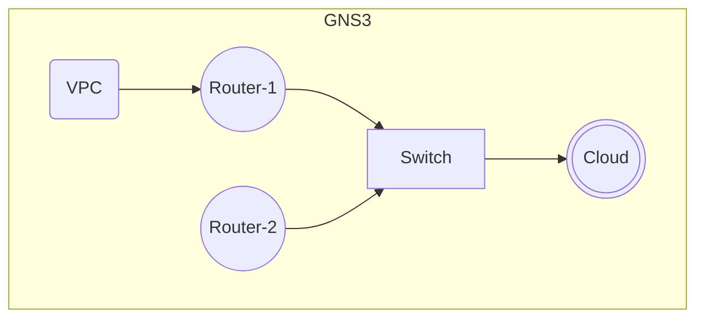

```toml
[Switch]
Gi0/0 = Router-1:Gi0/0
Gi0/1 = Router-2:Gi0/0
Gi0/2 = Cloud:enp0s31f6
Gi0/3 = Cloud:wlp1s0

[Router-1]
Gi0/0 = IOSvL2-1:Gi0/0
Gi0/1 = VPC:Ethernet0

[Cloud1]
address: [wlp1s0="192.168.1.12/24", enp0s31f6=""]
```
